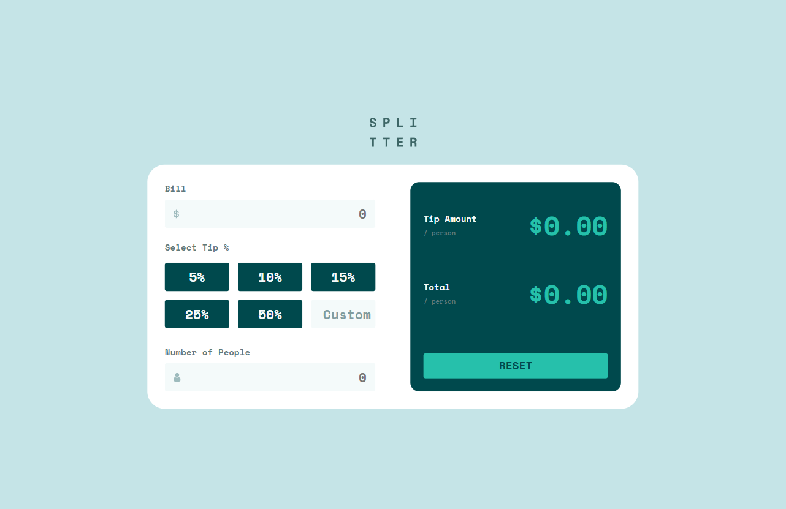
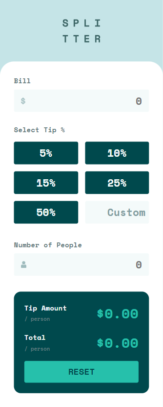

# Frontend Mentor - Tip calculator app solution

This is a solution to the [Tip calculator app challenge on Frontend Mentor](https://www.frontendmentor.io/challenges/tip-calculator-app-ugJNGbJUX). Frontend Mentor challenges help you improve your coding skills by building realistic projects.

## Table of contents

- [Overview](#overview)
  - [The challenge](#the-challenge)
  - [Screenshot](#screenshot)
  - [Links](#links)
- [My process](#my-process)
  - [Built with](#built-with)
  - [What I learned](#what-i-learned)
  - [Continued development](#continued-development)
- [Author](#author)

## Overview

### The challenge

Users should be able to:

- View the optimal layout for the app depending on their device's screen size
- See hover states for all interactive elements on the page
- Calculate the correct tip and total cost of the bill per person

### Screenshot

#### Desktop View

#### Mobile View

### Links

[Live Version](https://chimerical-pixie-553971.netlify.app)

## My process

### Built with

- Semantic HTML5 markup
- CSS custom properties
- Flexbox
- CSS Grid
- Mobile-first workflow
- Native JavaScript

### What I learned

This project was a good recap of the basics of DOM manipulation and various calculations with JavaScript. It also allowed me another chance to practice writing well formatted HTML and CSS, with some refactoring here and there to avoid repetition and increase readability.

I took a mobile first approach to designing the interface, which made making the website responsive much easier

### Continued development

Next for my studies I plan on taking on either a landing page to focus on my pure HTML/CSS skills, along with another, more difficult project that involves more JS and moving parts on the website (a 3+ difficulty higher project).

I am also learning Svelte currently, and plan to do some of the projects with this framework as it is quite fun, and simplifies things a lot.
## Author

- Website - [Brock Legentil](https://www.linkedin.com/in/brocklegentil/)
- Frontend Mentor - [@Eliksni](https://www.frontendmentor.io/profile/Eliksni)
- Twitter - [@Eliksnii](https://www.twitter.com/Eliksnii)

